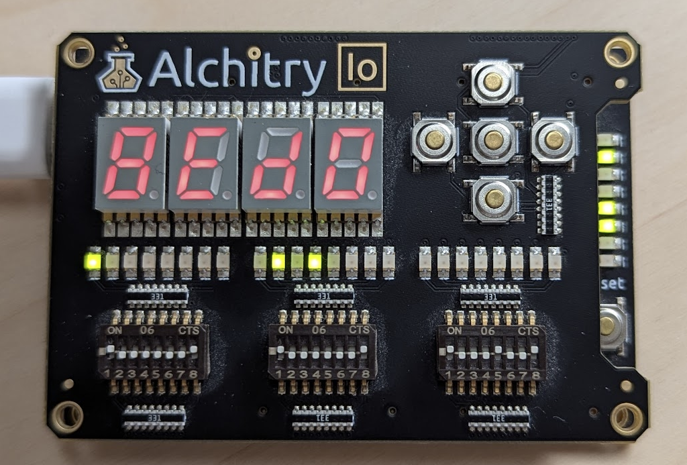

# CPU 16

Simple load-store 16-bit CPU ISA, along with a Rust simulator and Veryl design.

## Instruction Set

| Instruction | Description       | Opcode | Flags       | Arguments                                      |
| ----------- | ----------------- | ------ | ----------- | ---------------------------------------------- |
| CTL         | Control flags     | 0b00   | Zero, Carry | <padding: 11> <ctrl_op: 3>                     |
| SET         | Set register      | 0b01   | -           | <dst: 3> <value: 11>                           |
| MEM         | Load/Store memory | 0b10   | -           | <dst: 3> <addr: 3> <load/store: 1> <offset: 7> |
| ALU         | ALU operation     | 0b11   | Zero, Carry | <dst: 3> <src1: 3> <src2: 3> <alu_op: 5>       |

### Registers

| Register | Description                                    | Index |
| -------- | ---------------------------------------------- | ----- |
| Z        | Zero register (always 0, cannot be written to) | 0     |
| R1       | General purpose register                       | 1     |
| R2       | General purpose register                       | 2     |
| R3       | General purpose register                       | 3     |
| R4       | General purpose register                       | 4     |
| TMP      | Temporary value register                       | 5     |
| SP       | Stack pointer                                  | 6     |
| PC       | Program counter                                | 7     |

### CtrlOps

| Opcode | Operation  |
| ------ | ---------- |
| 0b000  | Halt       |
| 0b001  | SetZero    |
| 0b010  | ClearZero  |
| 0b011  | SetCarry   |
| 0b100  | ClearCarry |

### AluOps

| Opcode   | Operation                 |
| -------- | ------------------------- |
| 0b000_00 | Add                       |
| 0b000_01 | Sub                       |
| 0b000_10 | Adc (Add with carry)      |
| 0b000_11 | Sbc (Subtract with carry) |
| 0b001_00 | AddIfZero                 |
| 0b001_01 | SubIfZero                 |
| 0b001_10 | AdcIfZero                 |
| 0b001_11 | SbcIfZero                 |
| 0b010_00 | AddIfNotZero              |
| 0b010_01 | SubIfNotZero              |
| 0b010_10 | AdcIfNotZero              |
| 0b010_11 | SbcIfNotZero              |
| 0b011_00 | AddIfCarry                |

**The assembler defines common operations using these primitive instructions.**

## Generating bin files

### Nexys A7 (Xilinx Artix 7 XC7A100T)

1. Install [Vivado](https://alchitry.com/tutorials/setup/vivado/)
2. Run `make build-vivado` in the fpga directory
3. The bitstream will be in fpga/build/cpu16_Top.bin
4. Run openFPGALoader or any other compatible tool to program the FPGA
